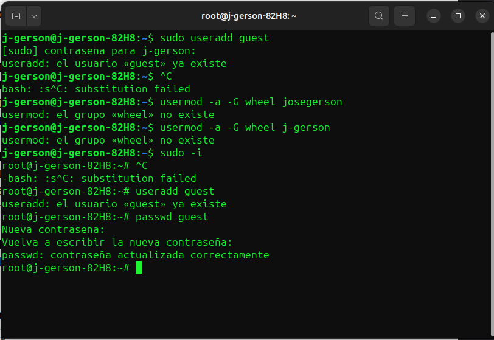
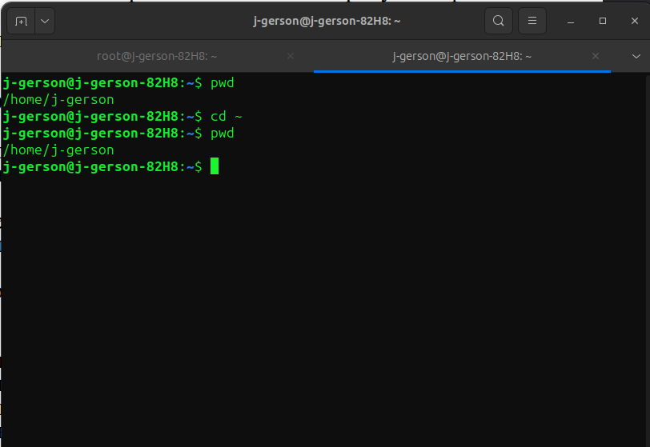
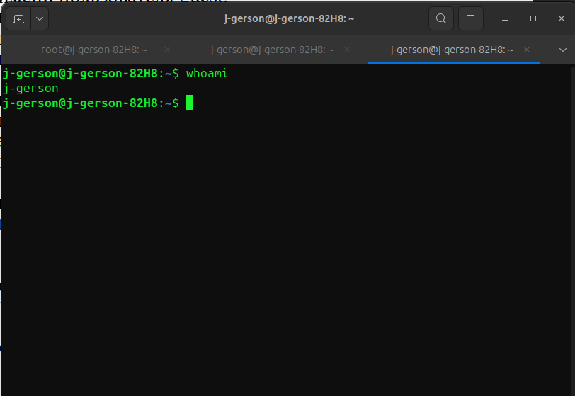
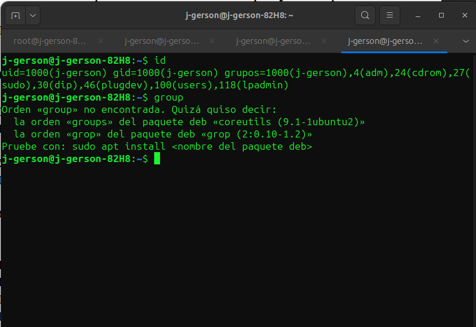
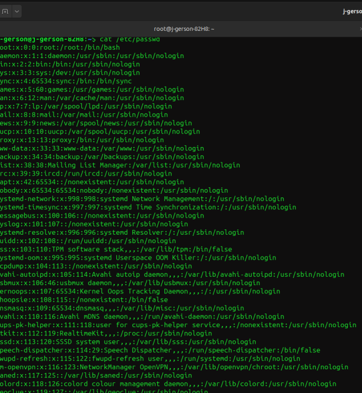
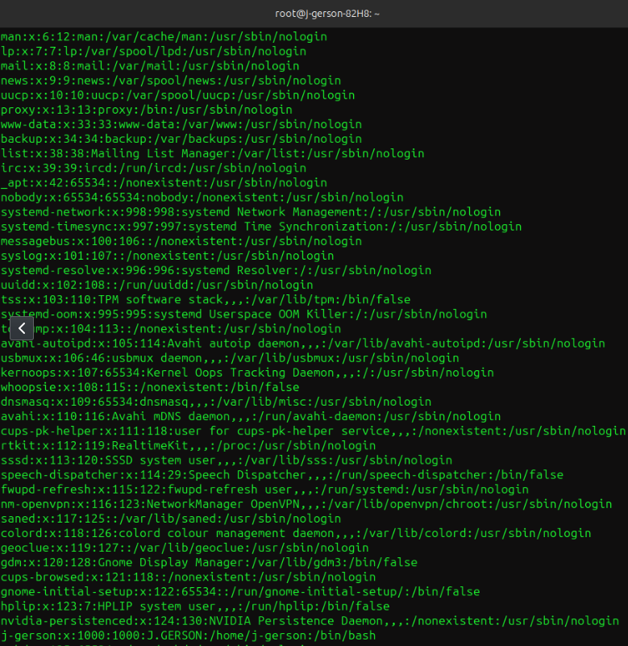
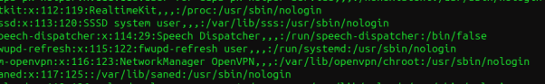

---
## Front matter
lang: ru-RU
title: Дискреционное разграничение прав в Linux. Основные атрибуты
author: |
	 НВЕ МАНГЕ ХОСЕ ХЕРСОН МИКО; НКАбд-03-22\inst{1}

institute: |
	\inst{1}Российский Университет Дружбы Народов

date: 02 марта 2024, Москва, Россия

## Formatting
mainfont: PT Serif
romanfont: PT Serif
sansfont: PT Sans
monofont: PT Mono
toc: false
slide_level: 2
theme: metropolis
header-includes: 
 - \metroset{progressbar=frametitle,sectionpage=progressbar,numbering=fraction}
 - '\makeatletter'
 - '\beamer@ignorenonframefalse'
 - '\makeatother'
aspectratio: 169
section-titles: true

---
# Информация

:::::::::::::: {.columns align=center}
::: {.column width="70%"}

  * НВЕ МАНГЕ ХОСЕ ХЕРСОН МИКО
  * Студент, НКАбд-03-22
  * Российский университет дружбы народов
  * [1032225355@pfur.ru](mailto: 1032225355@pfur.ru)

:::
::: {.column width="30%"}

:::
::::::::::::::

# Цели и задачи работы

## Цель лабораторной работы

Получение практических навыков работы в консоли с атрибутами файлов, закрепление теоретических основ дискреционного разграничения доступа в современных системах с открытым кодом на базе ОС Linux. 

# Процесс выполнения лабораторной работы

## Определяем UID и группу
 Cоздаем учётную запись пользователя guest и его пароль.
 
{ #fig:001 width=80% height=80% }

## Определяем UID и группу
Информация о пользователе guest

{ #fig:002 width=80% height=80% }

## Файл с данными о пользователях

посмотрим на файл /etc/passwd и найдем в нём свою учётную запись.

{ #fig:003 width=80% height=80% }

## Доступ к домашним директориям
Определите существующие в системе директории командой ls -l /home/

{ #fig:004 width=80% height=80% }

## Атрибуты директории
Cоздаем в домашней директории поддиректорию dir1 командой mkdir dir1

{ #fig:005 width=70% height=70% }

## Атрибуты директории
{ #fig:006 width=70% height=70% }

## Права и разрешённые действия

{ #fig:007 width=80% height=80% }

# Выводы по проделанной работе

## Вывод

В ходе выполнения лабораторной работы были получены навыки работы с атрибутами файлов и сведения о разграничении доступа.

