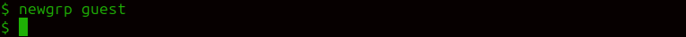

---
## Front matter
lang: ru-RU
title: Лабораторная работа №3
author: |
	 НВЕ МАНГЕ ХОСЕ ХЕРСОН МИКО; НКАбд-03-22\inst{1}

institute: |
	\inst{1}Российский Университет Дружбы Народов

date: 02 марта 2024, Москва, Россия

## Formatting
mainfont: PT Serif
romanfont: PT Serif
sansfont: PT Sans
monofont: PT Mono
toc: false
slide_level: 2
theme: metropolis
header-includes: 
 - \metroset{progressbar=frametitle,sectionpage=progressbar,numbering=fraction}
 - '\makeatletter'
 - '\beamer@ignorenonframefalse'
 - '\makeatother'
aspectratio: 169
section-titles: true

---
# Информация

:::::::::::::: {.columns align=center}
::: {.column width="70%"}

  * НВЕ МАНГЕ ХОСЕ ХЕРСОН МИКО
  * Студент, НКАбд-03-22
  * Российский университет дружбы народов
  * [1032225355@pfur.ru](mailto: 1032225355@pfur.ru)

:::
::: {.column width="30%"}

:::
::::::::::::::

# Цель работы

Целью работы является получение практических навыков работы в консоли с атрибутами файлов для групп пользователей.

# Выполнение лабораторной работы

##

{#fig:001 width=70%}

##

{#fig:003 width=70%}

##

{#fig:004 width=70%}

##

{#fig:005 width=70%}

##

{#fig:007 width=70%}

##

{#fig:008 width=70%}

##

{#fig:009 width=70%}

# Выводы

Я получила практические навыки работы в консоли с атрибутами файлов для групп пользователей.
