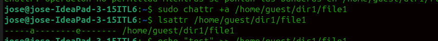
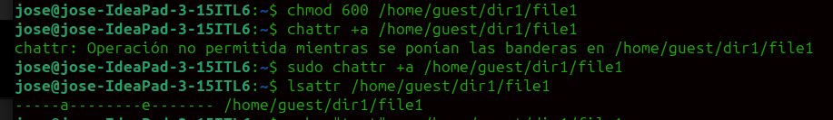
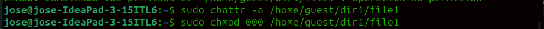
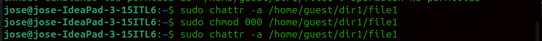
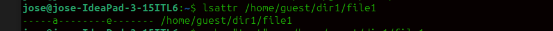
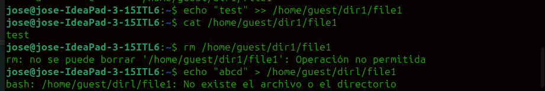
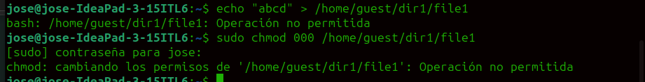

---
## Front matter
lang: ru-RU
title: Лабораторная работа №4
subtitle: Информационная безопасность
author:
  - НВЕ МАНГЕ  ХОСЕ ХЕРСОН М.
institute:
  - Российский университет дружбы народов, Москва, Россия
date: 8.03.2024

## i18n babel
babel-lang: russian
babel-otherlangs: english

## Formatting pdf
toc: false
toc-title: Содержание
slide_level: 2
aspectratio: 169
section-titles: true
theme: metropolis
header-includes:
 - \metroset{progressbar=frametitle,sectionpage=progressbar,numbering=fraction}
 - '\makeatletter'
 - '\beamer@ignorenonframefalse'
 - '\makeatother'
---

# Информация

:::::::::::::: {.columns align=center}
::: {.column width="70%"}

  * НВЕ МАНГЕ ХОСЕ ХЕРСОН МИКО
  * Студент, НКАбд-03-22
  * Российский университет дружбы народов
  * [1032225355@pfur.ru](mailto: 1032225355@pfur.ru)

:::
::: {.column width="30%"}

:::
::::::::::::::

# Цель работы

Целью данной лабораторной работы является получение практических навыков работы в консоли с расширенными атрибутами файлов.

# Выполнение лабораторной работы

{#fig:001 width=70%}

##

{#fig:002 width=70%}

##

{#fig:003 width=70%}

##

{#fig:004 width=70%}

##

{#fig:005 width=70%}

##

{#fig:006 width=70%}

##

{#fig:008 width=70%}

# Выводы

В результате выполнения данной лабораторной работы я получила практические навыки работы в консоли с расширенными атрибутами файлов.
