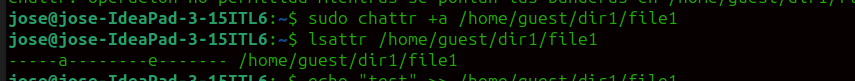
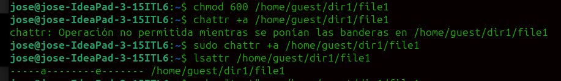
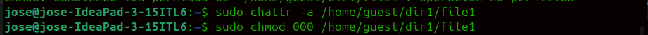
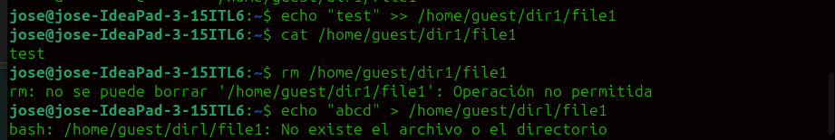
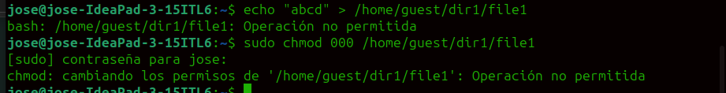

---
## Front matter
title: "Лабораторная работа №4"
subtitle: "основы информационной безопасности"
author: "НВЕ МАНГЕ ХОСЕ ХЕРСОН МИКО, НКАбд-3-22"

## Generic otions
lang: ru-RU
toc-title: "Содержание"

## Bibliography
bibliography: bib/cite.bib
csl: pandoc/csl/gost-r-7-0-5-2008-numeric.csl

## Pdf output format
toc: true # Table of contents
toc-depth: 2
lof: true # List of figures
lot: true # List of tables
fontsize: 12pt
linestretch: 1.5
papersize: a4
documentclass: scrreprt
## I18n polyglossia
polyglossia-lang:
  name: russian
  options:
	- spelling=modern
	- babelshorthands=true
polyglossia-otherlangs:
  name: english
## I18n babel
babel-lang: russian
babel-otherlangs: english
## Fonts
mainfont: PT Serif
romanfont: PT Serif
sansfont: PT Sans
monofont: PT Mono
mainfontoptions: Ligatures=TeX
romanfontoptions: Ligatures=TeX
sansfontoptions: Ligatures=TeX,Scale=MatchLowercase
monofontoptions: Scale=MatchLowercase,Scale=0.9
## Biblatex
biblatex: true
biblio-style: "gost-numeric"
biblatexoptions:
  - parentracker=true
  - backend=biber
  - hyperref=auto
  - language=auto
  - autolang=other*
  - citestyle=gost-numeric
## Pandoc-crossref LaTeX customization
figureTitle: "Рис."
tableTitle: "Таблица"
listingTitle: "Листинг"
lofTitle: "Список иллюстраций"
lotTitle: "Список таблиц"
lolTitle: "Листинги"
## Misc options
indent: true
header-includes:
  - \usepackage{indentfirst}
  - \usepackage{float} # keep figures where there are in the text
  - \floatplacement{figure}{H} # keep figures where there are in the text
---

# Цель работы

Целью данной лабораторной работы является получение практических навыков работы в консоли с расширенными атрибутами файлов.

# Выполнение лабораторной работы

Сначала от имени пользователя guest определяю расширенные атрибуты файла /home/guest/dir1/file1 командой **lsattr /home/guest/dir1/file1** (рис. [-@fig:001]).

{#fig:001 width=70%}

Устанавливаю на файл file1 права, разрешающие чтение и запись для владельца файла (рис. [-@fig:002]).

{#fig:002 width=70%}

Пробую установить на файл /home/guest/dir1/file1 расширенный атрибут +a от имени пользователя guest, но мне отказано в доступе (рис. [-@fig:003]).

{#fig:003 width=70%}

Захожу на третью консоль с правами администратора и пробую установить расширенный атрибут a на файл /home/guest/dir1/file1 от имени суперпольователя: (рис. [-@fig:004]).

{#fig:004 width=70%}

От пользователя guest проверяю правильность установки атрибута (рис. [-@fig:005]).

{#fig:005 width=70%}

Записываю в файл слово «test» через утилиту **echo "test" /home/guest/dir1/file1** (рис. [-@fig:006]).

{#fig:006 width=70%}

Попробую удалить файл file1 либо стереть имеющуюся в нём информацию командой echo "abcd" > /home/guest/dirl/file1, но мне отказано в доступеС помощью команды chmod 000 file1 установливаю на файл file1 права, например, запрещающие чтение и запись для владельца файла, но мне вновь отказано в доступе (рис. [-@fig:008]).

{#fig:008 width=70%}

9. Снимаю расширенный атрибут a с файла /home/guest/dirl/file1 от имени суперпользователя командой **chattr -a /home/guest/dir1/file1** и повторяю операции, которые мне ранее не удавалось выполнить. Ничего не поменялось.

# Выводы

В результате выполнения данной лабораторной работы я получила практические навыки работы в консоли с расширенными атрибутами файлов.

