---
## Front matter
title: "Лабораторная работа №5"
subtitle: "Информационная безопасность"
author: "НВЕ МАНГЕ ХОСЕ ХЕРСОН МИКО; НКАбд-03-22"

## Generic otions
lang: ru-RU
toc-title: "Содержание"

## Bibliography
bibliography: bib/cite.bib
csl: pandoc/csl/gost-r-7-0-5-2008-numeric.csl

## Pdf output format
toc: true # Table of contents
toc-depth: 2
lof: true # List of figures
lot: true # List of tables
fontsize: 12pt
linestretch: 1.5
papersize: a4
documentclass: scrreprt
## I18n polyglossia
polyglossia-lang:
  name: russian
  options:
	- spelling=modern
	- babelshorthands=true
polyglossia-otherlangs:
  name: english
## I18n babel
babel-lang: russian
babel-otherlangs: english
## Fonts
mainfont: PT Serif
romanfont: PT Serif
sansfont: PT Sans
monofont: PT Mono
mainfontoptions: Ligatures=TeX
romanfontoptions: Ligatures=TeX
sansfontoptions: Ligatures=TeX,Scale=MatchLowercase
monofontoptions: Scale=MatchLowercase,Scale=0.9
## Biblatex
biblatex: true
biblio-style: "gost-numeric"
biblatexoptions:
  - parentracker=true
  - backend=biber
  - hyperref=auto
  - language=auto
  - autolang=other*
  - citestyle=gost-numeric
## Pandoc-crossref LaTeX customization
figureTitle: "Рис."
tableTitle: "Таблица"
listingTitle: "Листинг"
lofTitle: "Список иллюстраций"
lotTitle: "Список таблиц"
lolTitle: "Листинги"
## Misc options
indent: true
header-includes:
  - \usepackage{indentfirst}
  - \usepackage{float} # keep figures where there are in the text
  - \floatplacement{figure}{H} # keep figures where there are in the text
---

# Цель работы

Целью работы является изучение механизмов изменения идентификаторов, применения SetUID- и Sticky-битов. Получение практических навыков работы в консоли с дополнительными атрибутами. Рассмотрение работы механизма смены идентификатора процессов пользователей, а также влияние бита Sticky на запись и удаление файлов.

# Теоретическое введение

Setuid, Setgid и Sticky Bit - это специальные типы разрешений позволяют задавать расширенные права доступа на файлы или каталоги.

# Подготовка к выполнению работы

Я проверила, установлен ли у меня gcc командой **yum install gcc**. Он установлен и обновлен до последней версии (рис. [-@fig:000]).

{#fig:000 width=70%}

Помимо этого, я отключила систему запретов до очередной перезагрузки системы командой **setenforce 0**. После этого команда getenforce выводит Permissive (рис. [-@fig:001]).

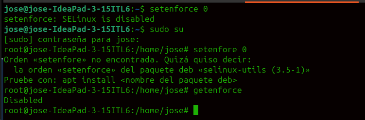{#fig:001 width=70%}

# Выполнение лабораторной работы

## Создание программы

Я вошла в систему от имени пользователя guest (рис. [-@fig:002]).

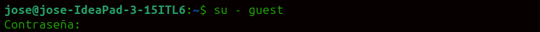{#fig:002 width=70%}

Далее создала программу simpleid.c и заполнила ее (рис. [-@fig:003]), (рис. [-@fig:004]).

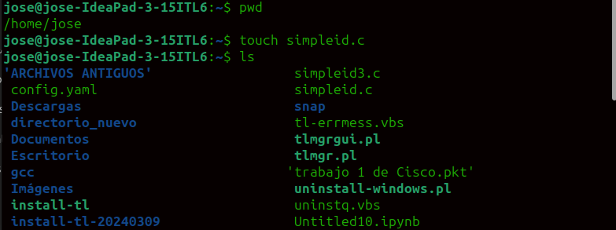{#fig:003 width=70%}

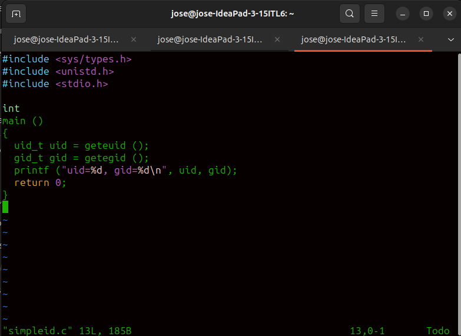{#fig:004 width=70%}

Скомплилировала файл через **gcc simpleid.c -o simpleid** и выполнила программу simpleid  (рис. [-@fig:006]).

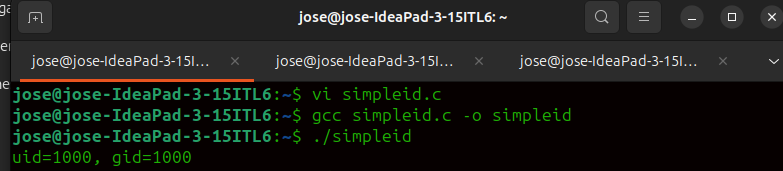{#fig:006 width=70%}

Выполнила системную программу id. Результаты похожи. Gid и uid одинаковые, однако команда id дает больше информации (рис. [-@fig:007]).

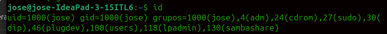{#fig:007 width=70%}

Усложнила программу, добавив вывод действительных идентификаторов (рис. [-@fig:008]).

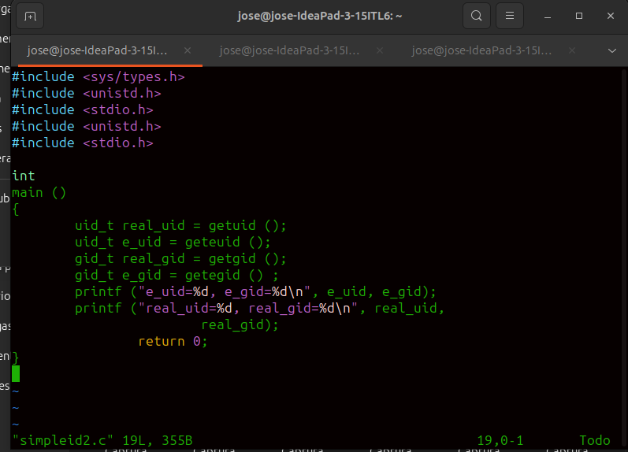{#fig:008 width=70%}

Скомпилировала и запустила simpleid2.c (рис. [-@fig:009]).

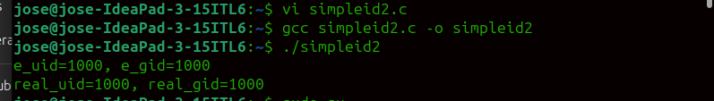{#fig:009 width=70%}

От имени суперпользователя выполнила команды **chown root:guest /home/guest/simpleid2, chmod u+s /home/guest/simpleid2** (рис. [-@fig:010]).

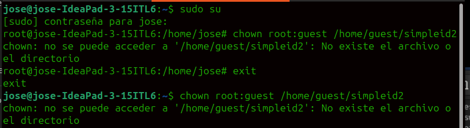{#fig:010 width=70%}

Выполнила проверку правильности установки новых атрибутов и смены владельца файла simpleid2  (рис. [-@fig:011]).

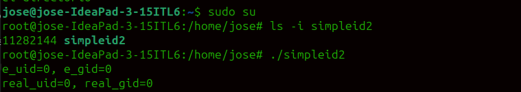{#fig:011 width=70%}

Запустила simpleid2 и id. Результаты похожи. Gid и uid одинаковые, однако команда id дает больше информации (рис. [-@fig:012]).

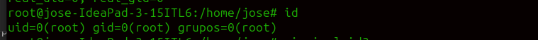{#fig:012 width=70%}

Создала программу readfile.c (рис. [-@fig:013]).

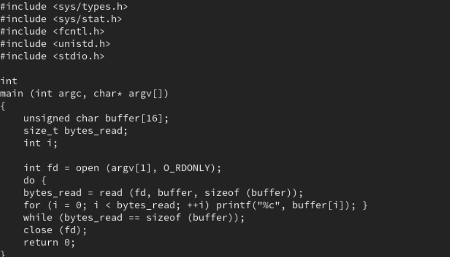{#fig:013 width=70%}

Откомпилировала её (рис. [-@fig:014]).

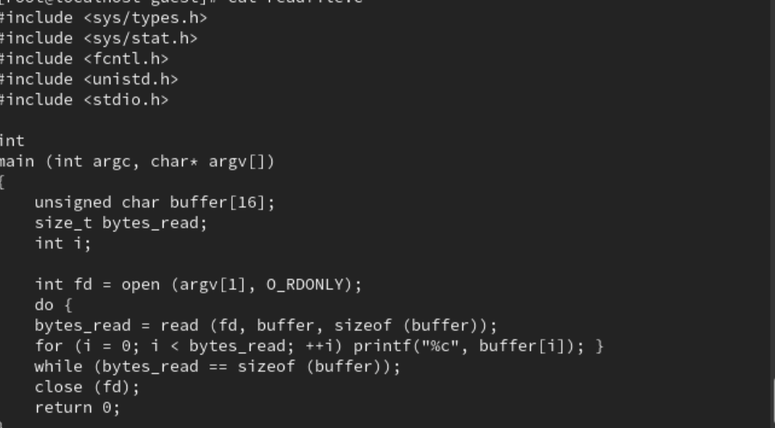{#fig:014 width=70%}

Сменила владельца у файла readfile.c и изменила права так, чтобы только суперпользователь (root) мог прочитать его, a aleksandrovauv не мог.
Проверила, может ли пользователь прочитать файл readfile.c. Не может (рис. [-@fig:015]).

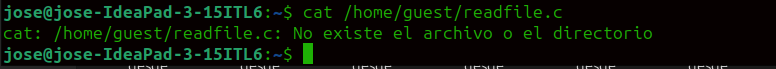{#fig:015 width=70%}

Программа readfile в целом может прочитать файл /etc/shadow (рис. [-@fig:016]).

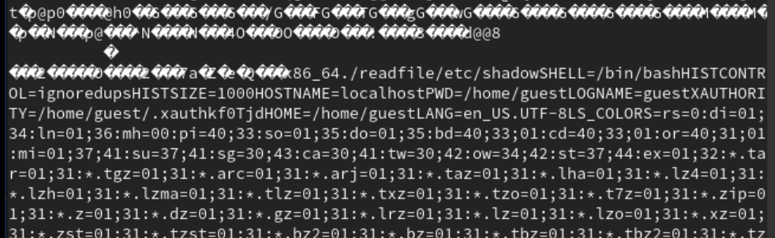{#fig:016 width=70%}

##  Исследование Sticky-бита

Выяснила, установлен ли атрибут Sticky на директории /tmp. Установлен.  
От имени пользователя guest создала файл file01.txt в директории /tmp со словом test через **echo "test" > /tmp/file01.txt**. Затем просмотрите атрибуты у только что созданного файла и разрешила чтение и запись для категории пользователей «все остальные» при помощи утилиты **chmod o+rw /tmp/file01.txt** (рис. [-@fig:017]).

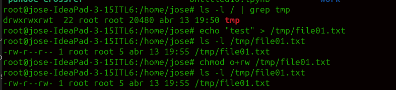{#fig:017 width=70%}

От пользователя guest2 (не являющегося владельцем) попробовала прочитать файл /tmp/file01.txt. Попробовала дозаписать в файл
/tmp/file01.txt слово test2 командой **echo "test2" > /tmp/file01.txt**. Мне отказано в доступе. То же самое попробовала сделать с test3, но мне снова отказано в доступе. Файл не записался (рис. [-@fig:018]).

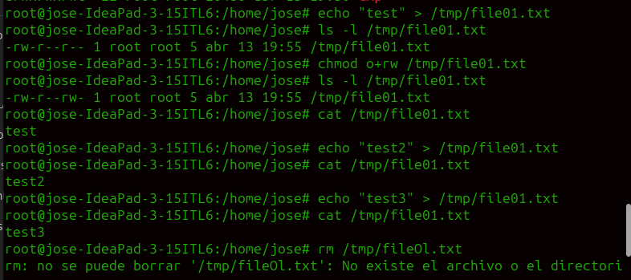{#fig:018 width=70%}

От пользователя guest2 попробовала удалить файл /tmp/file01.txt. Мне отказали в доступе. Потом я повысила свои права до суперпользователя командой **su -** и сняла атрибут t (Sticky-бит) с директории /tmp. От пользователя guest2 проверила, что атрибута t у директории /tmp нет. Повторила предыдущие шаги. Файл удалился  (рис. [-@fig:019]).

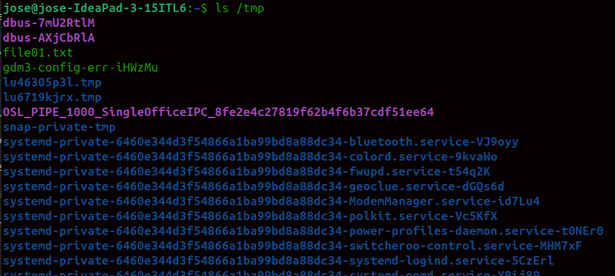{#fig:019 width=70%}

Вернула атрибут t (рис. [-@fig:020]).

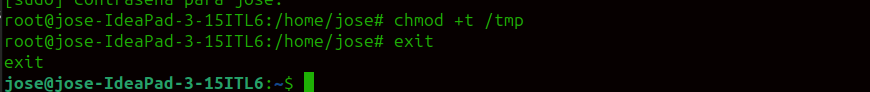{#fig:020 width=70%}

# Выводы

Я изучила механизмы изменения идентификаторов, применения SetUID- и Sticky-битов. Полученила практических навыков работы в консоли с дополнительными атрибутами.

