---
## Front matter
lang: ru-RU
title: Лабораторная работа №6
subtitle: Информационная безопасность
author:
  - НВЕ МАНГЕ ХОСЕ ХЕРСОН МИКО
institute:
  - Российский университет дружбы народов, Москва, Россия
date: 12.03.2024

## i18n babel
babel-lang: russian
babel-otherlangs: english

## Formatting pdf
toc: false
toc-title: Содержание
slide_level: 2
aspectratio: 169
section-titles: true
theme: metropolis
header-includes:
 - \metroset{progressbar=frametitle,sectionpage=progressbar,numbering=fraction}
 - '\makeatletter'
 - '\beamer@ignorenonframefalse'
 - '\makeatother'
---
# Информация

:::::::::::::: {.columns align=center}
::: {.column width="70%"}

  * НВЕ МАНГЕ ХОСЕ ХЕРСОН МИКО
  * Студент, НКАбд-03-22
  * Российский университет дружбы народов
  * [1032225355@pfur.ru](mailto: 1032225355@pfur.ru)

:::
::: {.column width="30%"}

:::
::::::::::::::

# Цель работы

Целью работы является изучение механизмов изменения идентификаторов, применения SetUID- и Sticky-битов.

# Подготовка к выполнению работы

{#fig:000 width=70%}

##

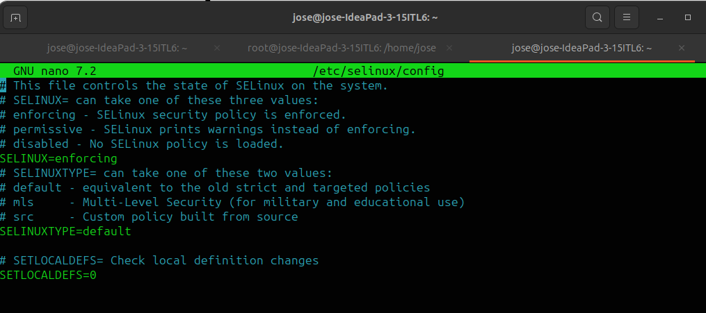{#fig:001 width=70%}

# Выполнение лабораторной работы

## Создание программы

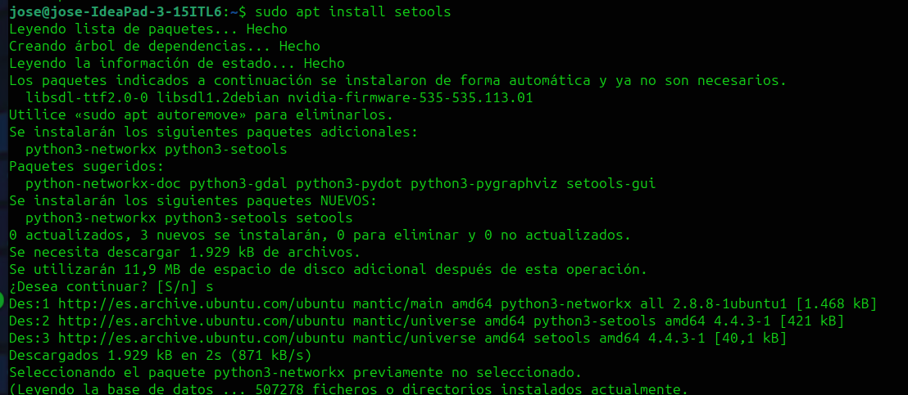{#fig:002 width=70%}

## Создание программы

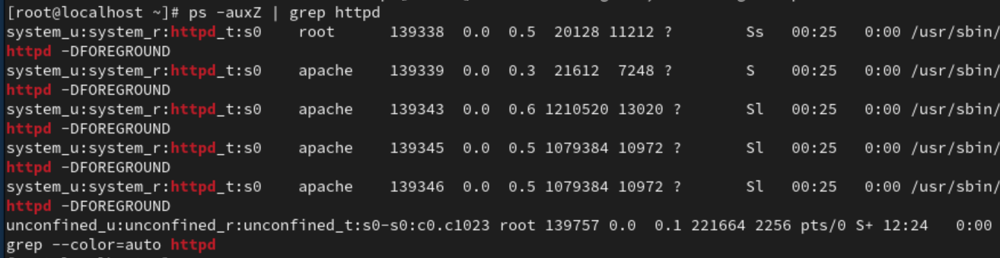{#fig:004 width=70%}

## Создание программы

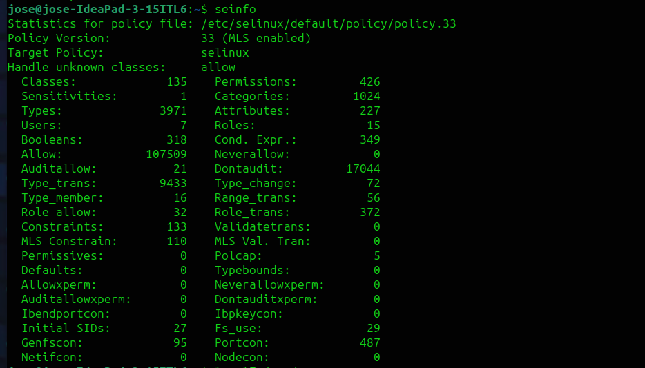{#fig:006 width=70%}

## Создание программы

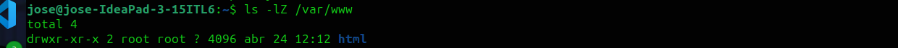{#fig:007 width=70%}

## Создание программы

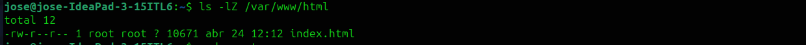{#fig:008 width=70%}

## Создание программы

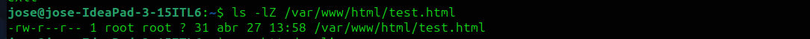{#fig:009 width=70%}

## Создание программы

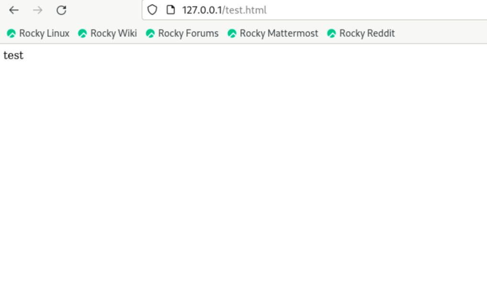{#fig:010 width=70%}

## Создание программы

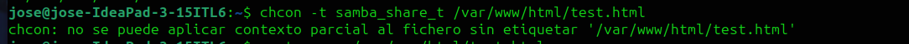{#fig:011 width=70%}

## Создание программы

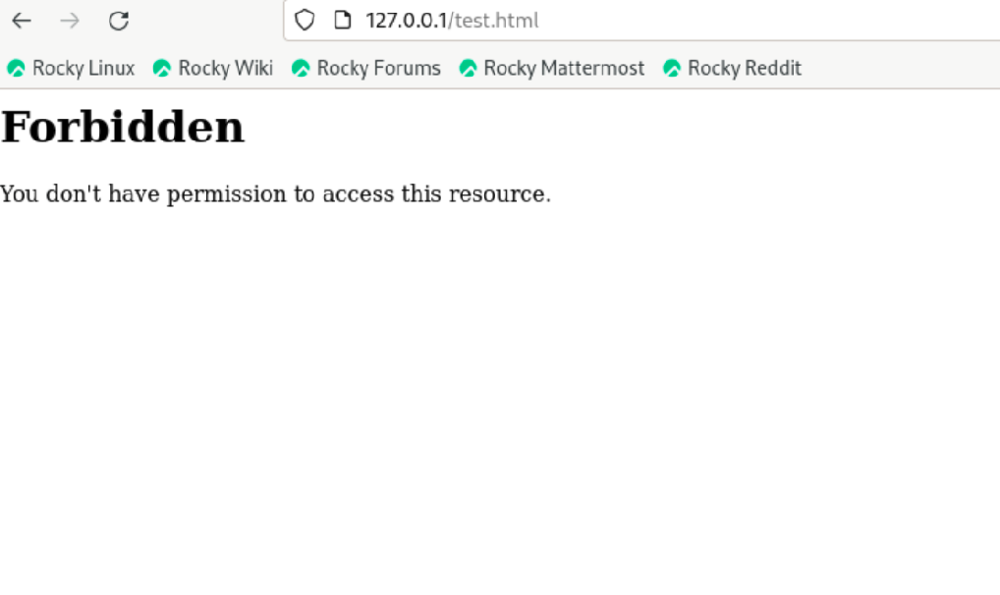{#fig:012 width=70%}

## Создание программы

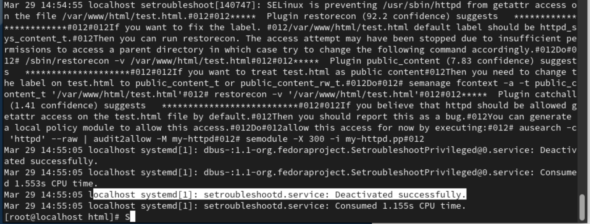{#fig:013 width=70%}

## Создание программы

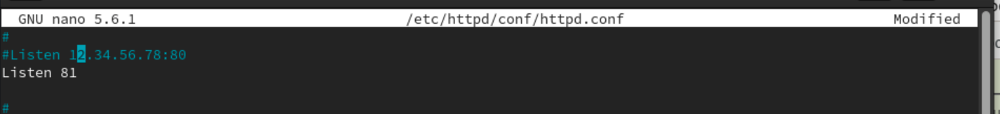{#fig:014 width=70%}

## Создание программы

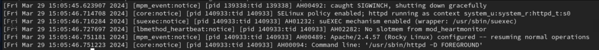{#fig:015 width=70%}

## Создание программы

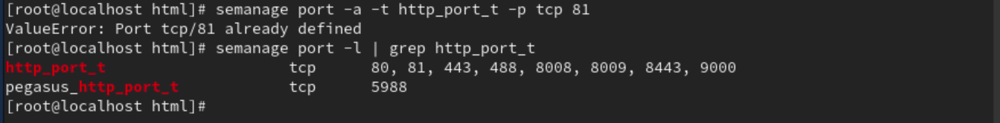{#fig:016 width=70%}

##  Исследование Sticky-бита

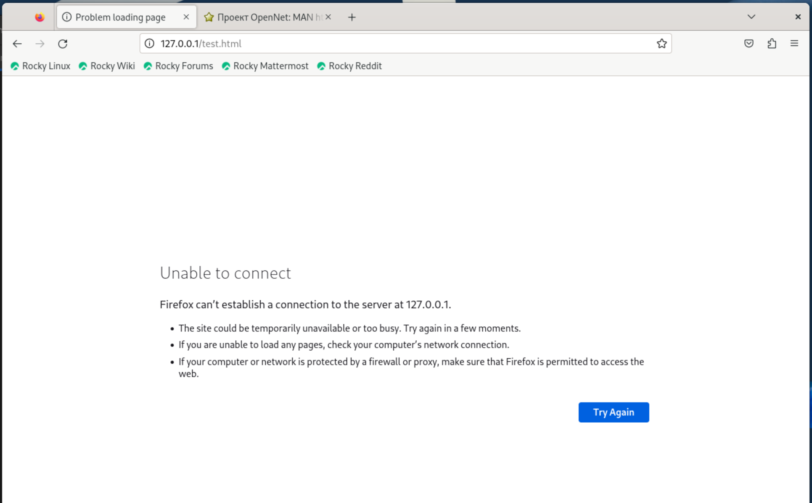{#fig:017 width=70%}

##  Исследование Sticky-бита

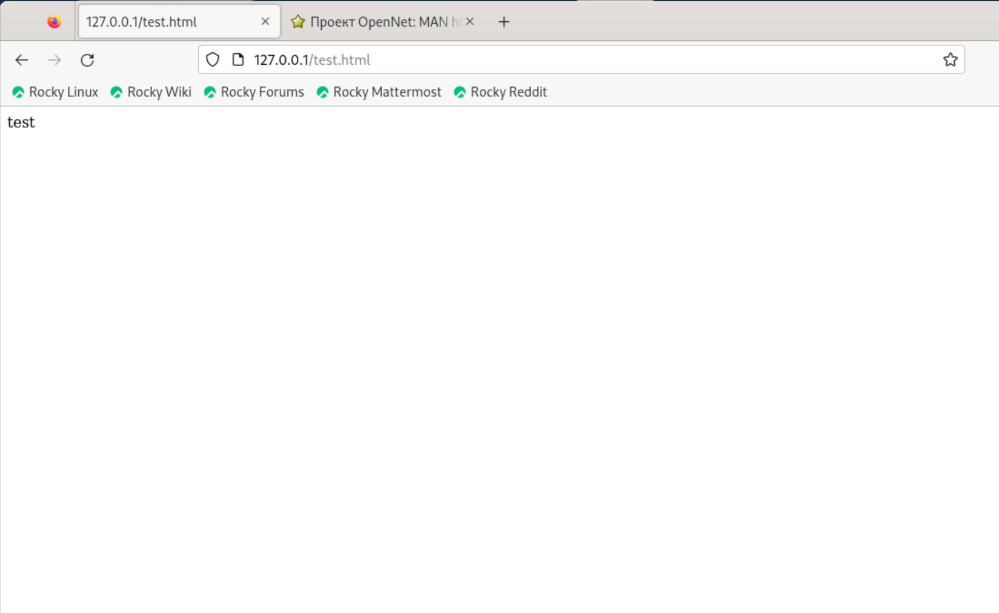{#fig:018 width=70%}

##  Исследование Sticky-бита

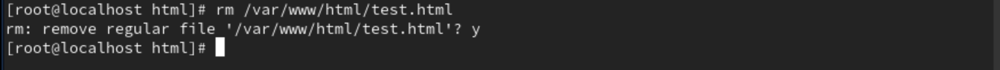{#fig:019 width=70%}

##  Исследование Sticky-бита

{#fig:020 width=70%}

# Выводы

Я изучила механизмы изменения идентификаторов, применения SetUID- и Sticky-битов. Полученила практических навыков работы в консоли с дополнительными атрибутами.

