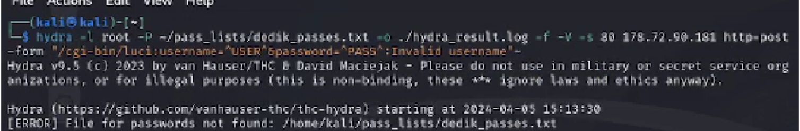
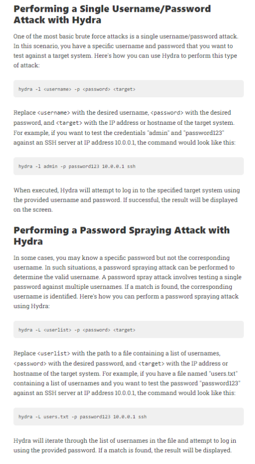
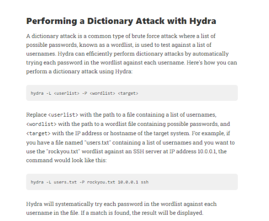
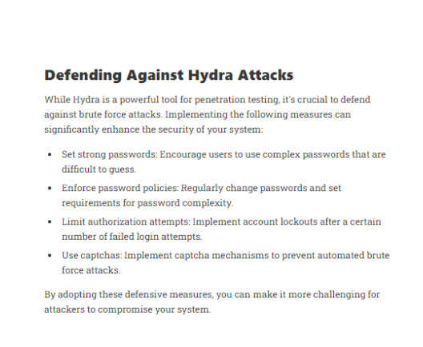

---
## Front matter
lang: ru-RU
title: Этап №3
author: |
	 НВЕ МАНГЕ ХОСЕ ХЕРСОН МИКО; НКАбд-03-22\inst{1}

institute: |
	\inst{1}Российский Университет Дружбы Народов

date: 06/04/2024, Москва, Россия

## Formatting
mainfont: PT Serif
romanfont: PT Serif
sansfont: PT Sans
monofont: PT Mono
toc: false
slide_level: 2
theme: metropolis
header-includes: 
 - \metroset{progressbar=frametitle,sectionpage=progressbar,numbering=fraction}
 - '\makeatletter'
 - '\beamer@ignorenonframefalse'
 - '\makeatother'
aspectratio: 169
section-titles: true

---
# Информация

:::::::::::::: {.columns align=center}
::: {.column width="70%"}

  * НВЕ МАНГЕ ХОСЕ ХЕРСОН МИКО
  * Студент, НКАбд-03-22
  * Российский университет дружбы народов
  * [1032225355@pfur.ru](mailto: 1032225355@pfur.ru)

:::
::: {.column width="30%"}

:::
::::::::::::::

## Цели и задачи

Попробовать в действии Hydra.

## Выполнение работы

## Используем пример из задания для работы с Hydra.

{#fig:001 width=70%}

## Изучим атаку Username/password и атаку Password Spraying в Hydra.

{#fig:001 width=70%}

## Изучим атаку Dictionary в Hydra, как классический вид брутфорс атаки.

{#fig:001 width=70%}

## Изучим основные способы защиты от атак Hydra.

{#fig:001 width=70%}

## Вывод

Я попробовал в действии Hydra.

## Список литературы

Кулябов Д.С. "Материалы к учебному проекту"

ROD TRENT - Using Kali Linux and Hydra for Attack Testing and Alert Generation, 2023.
